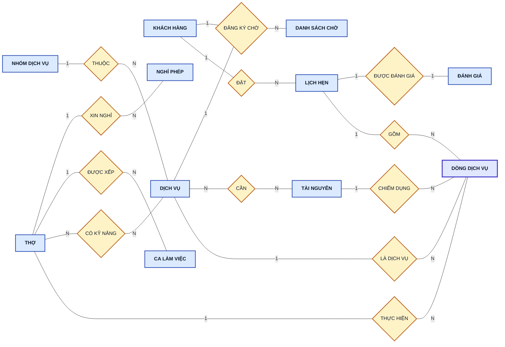
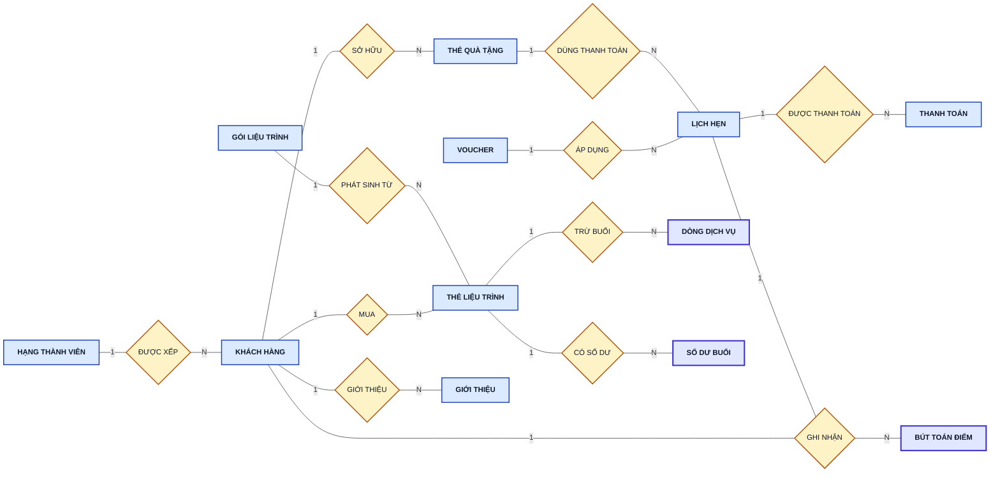
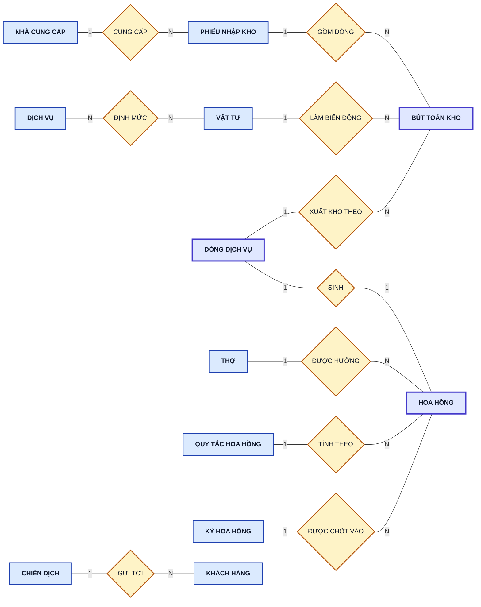
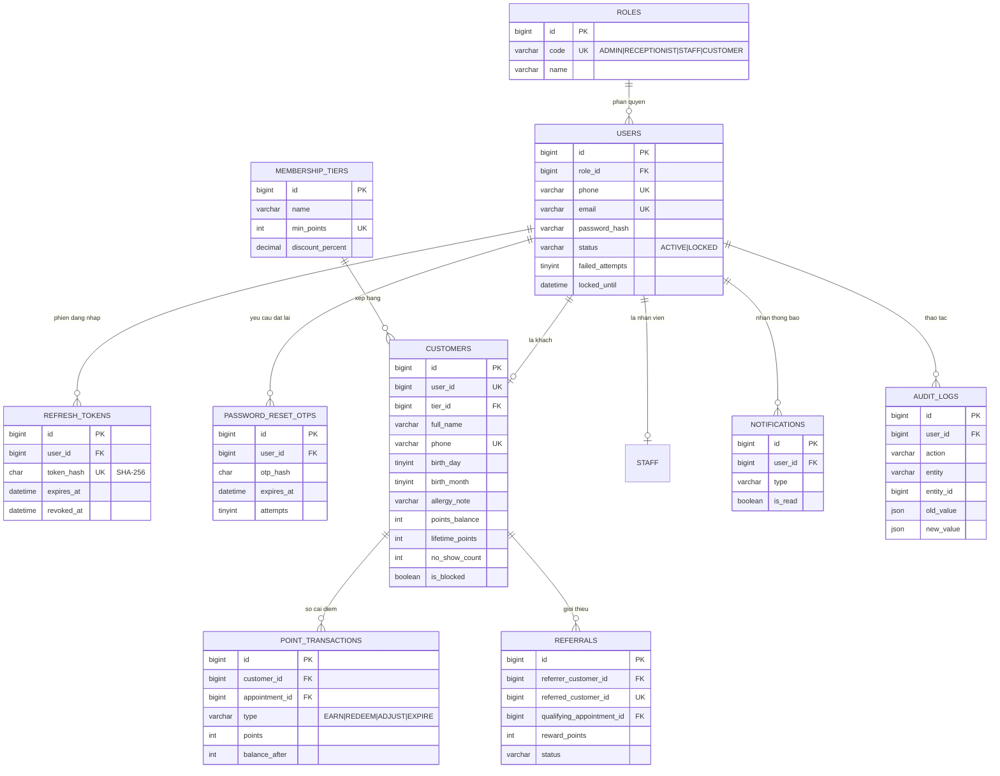
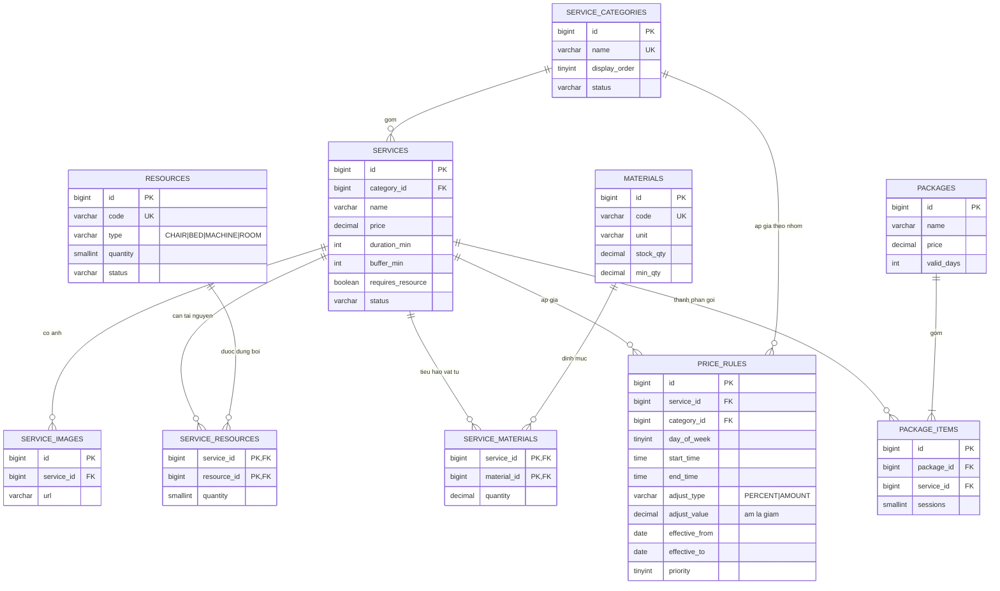
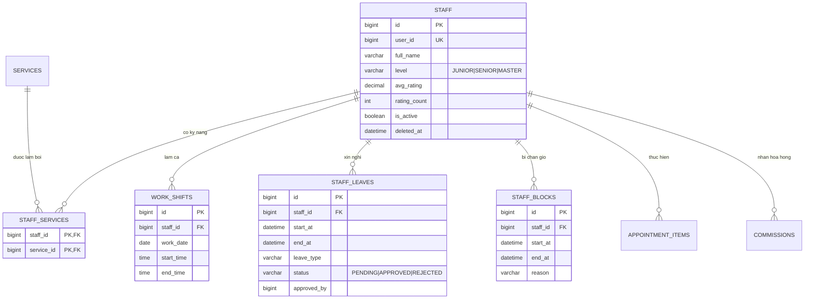
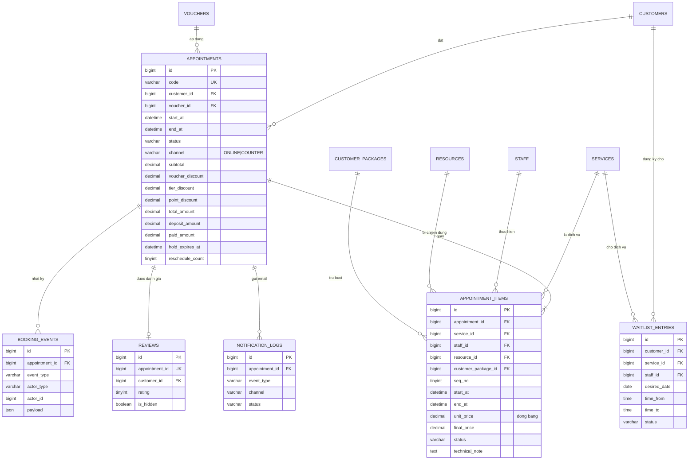
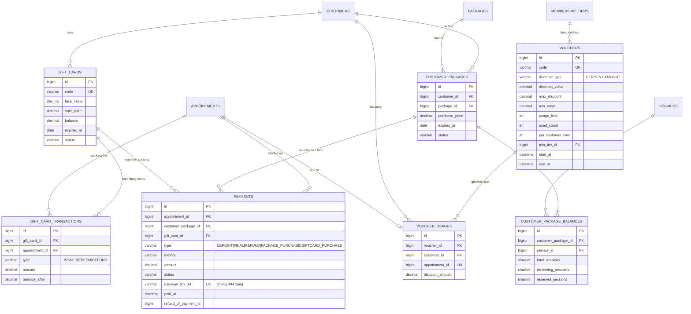
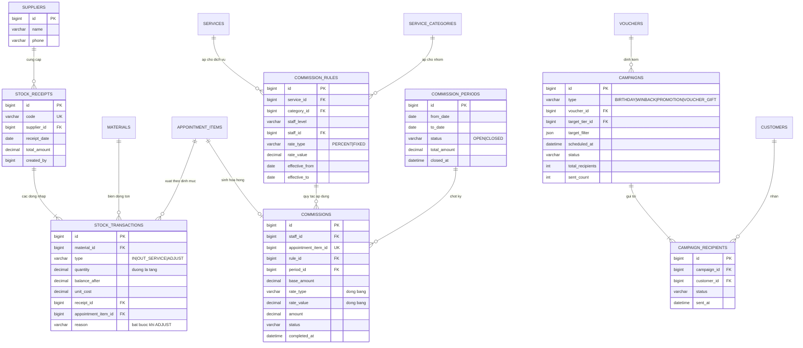

# ERD — Hệ thống đặt lịch & quản trị salon

Mô hình dữ liệu của hệ thống: **48 bảng · 500 cột**, MySQL 8.

Tài liệu gồm ba mức:

| Mức | Nội dung | Mục |
|---|---|---|
| **Quan niệm** (Chen) | Thực thể, mối kết hợp, bản số — mô tả nghiệp vụ, chưa có khóa ngoại | [1](#1-mô-hình-erd-mức-quan-niệm-chen) |
| **Logic** (crow's foot) | 48 quan hệ với khóa chính, khóa ngoại, cột chính | [2](#2-mô-hình-erd-mức-logic) |
| **Mô hình quan hệ** | Danh sách 48 quan hệ dạng văn bản + kiểm tra chuẩn hóa | [3](#3-mô-hình-quan-hệ) |

> Sơ đồ bên dưới viết bằng **Mermaid** nên GitHub hiển thị trực tiếp. Bản ảnh **PNG (300 dpi)** và **SVG** nằm trong thư mục [`images/`](images/) để chèn vào báo cáo Word; mã nguồn sơ đồ ở [`src/`](src/).

---

## 1. Mô hình ERD mức quan niệm (Chen)

Mô hình quan niệm mô tả **nghiệp vụ**, chưa nói tới khóa ngoại hay kiểu dữ liệu. Ở mức này, các bảng nối N–N (`staff_services`, `service_materials`, `service_resources`, `package_items`) **không phải thực thể** mà là **mối kết hợp**; chúng chỉ trở thành bảng khi chuyển sang mức logic (mục 3).

**Quy ước ký hiệu**

| Ký hiệu | Ý nghĩa |
|---|---|
| Hình chữ nhật viền mảnh | Thực thể thường (strong entity) |
| Hình chữ nhật viền đậm | Thực thể yếu — tồn tại phụ thuộc thực thể chủ (`DÒNG DỊCH VỤ`, `SỐ DƯ BUỔI`, `BÚT TOÁN ĐIỂM`, `BÚT TOÁN KHO`, `HOA HỒNG`) |
| Hình thoi | Mối kết hợp giữa các thực thể |
| Nhãn `1` / `N` trên cạnh | Bản số (cardinality) của thực thể phía đó |

### 1.1 Đặt lịch và nhân sự

### 1.2 Khách hàng, thanh toán và khuyến mãi

### 1.3 Kho vật tư, hoa hồng và chiến dịch

### 1.4 Danh sách thực thể và thuộc tính chính

| # | Thực thể | Loại | Thuộc tính chính | Khóa | Bảng tương ứng |
|---|---|---|---|---|---|
| 1 | KHÁCH HÀNG | Thường | họ tên, SĐT, email, ngày–tháng sinh, ghi chú dị ứng, điểm khả dụng, điểm trọn đời, số lần no-show | SĐT | `customers` |
| 2 | HẠNG THÀNH VIÊN | Thường | tên hạng, điểm tối thiểu, % giảm giá | điểm tối thiểu | `membership_tiers` |
| 3 | TÀI KHOẢN | Thường | SĐT, email, mật khẩu băm, trạng thái | SĐT | `users` |
| 4 | VAI TRÒ | Thường | mã, tên | mã | `roles` |
| 5 | THỢ | Thường | họ tên, cấp bậc, giới thiệu, điểm đánh giá trung bình | mã thợ | `staff` |
| 6 | CA LÀM VIỆC | Thường | ngày làm, giờ bắt đầu, giờ kết thúc | (thợ, ngày, giờ bắt đầu) | `work_shifts` |
| 7 | NGHỈ PHÉP | Thường | từ lúc, đến lúc, loại nghỉ, lý do, trạng thái duyệt | mã | `staff_leaves` |
| 8 | NHÓM DỊCH VỤ | Thường | tên, mô tả, thứ tự hiển thị | tên | `service_categories` |
| 9 | DỊCH VỤ | Thường | tên, giá, thời lượng, thời gian đệm, trạng thái | mã | `services` |
| 10 | TÀI NGUYÊN | Thường | mã, tên, loại, số lượng | mã | `resources` |
| 11 | LỊCH HẸN | Thường | mã lịch, giờ bắt đầu, giờ kết thúc, trạng thái, kênh đặt, tổng tiền, tiền cọc | mã lịch | `appointments` |
| 12 | **DÒNG DỊCH VỤ** | **Yếu** (phụ thuộc LỊCH HẸN) | thứ tự, giờ bắt đầu, giờ kết thúc, giá tại thời điểm đặt, giá sau giảm, trạng thái, ghi chú kỹ thuật | (lịch hẹn, thứ tự) | `appointment_items` |
| 13 | ĐÁNH GIÁ | Thường | số sao, nhận xét | lịch hẹn | `reviews` |
| 14 | DANH SÁCH CHỜ | Thường | ngày mong muốn, khung giờ chấp nhận, trạng thái | mã | `waitlist_entries` |
| 15 | THANH TOÁN | Thường | loại, phương thức, số tiền, trạng thái, mã giao dịch cổng | mã giao dịch cổng | `payments` |
| 16 | VOUCHER | Thường | mã, loại giảm, giá trị, đơn tối thiểu, số lượt, thời hạn | mã | `vouchers` |
| 17 | GÓI LIỆU TRÌNH | Thường | tên, giá, số ngày hiệu lực | mã | `packages` |
| 18 | THẺ LIỆU TRÌNH | Thường | giá mua, ngày mua, ngày hết hạn, trạng thái | mã | `customer_packages` |
| 19 | **SỐ DƯ BUỔI** | **Yếu** (phụ thuộc THẺ LIỆU TRÌNH) | tổng buổi, buổi còn lại, buổi đang giữ | (thẻ, dịch vụ) | `customer_package_balances` |
| 20 | THẺ QUÀ TẶNG | Thường | mã thẻ, mệnh giá, giá bán, số dư, ngày hết hạn | mã thẻ | `gift_cards` |
| 21 | **BÚT TOÁN ĐIỂM** | **Yếu** (phụ thuộc KHÁCH HÀNG) | loại, số điểm, số dư sau | mã | `point_transactions` |
| 22 | GIỚI THIỆU | Thường | mã giới thiệu, điểm thưởng, trạng thái | khách được giới thiệu | `referrals` |
| 23 | VẬT TƯ | Thường | mã, tên, đơn vị, tồn hiện tại, tồn tối thiểu | mã | `materials` |
| 24 | NHÀ CUNG CẤP | Thường | tên, SĐT, địa chỉ | mã | `suppliers` |
| 25 | PHIẾU NHẬP KHO | Thường | số phiếu, ngày nhập, tổng tiền | số phiếu | `stock_receipts` |
| 26 | **BÚT TOÁN KHO** | **Yếu** (phụ thuộc VẬT TƯ) | loại, số lượng, tồn sau, đơn giá, lý do | mã | `stock_transactions` |
| 27 | QUY TẮC HOA HỒNG | Thường | loại tỷ lệ, giá trị, khoảng hiệu lực | mã | `commission_rules` |
| 28 | **HOA HỒNG** | **Yếu** (phụ thuộc DÒNG DỊCH VỤ) | cơ sở tính, tỷ lệ đã áp, số tiền, trạng thái | dòng dịch vụ | `commissions` |
| 29 | KỲ HOA HỒNG | Thường | tên kỳ, từ ngày, đến ngày, trạng thái | (từ ngày, đến ngày) | `commission_periods` |
| 30 | CHIẾN DỊCH | Thường | tên, loại, tiêu đề, nội dung, lịch gửi, trạng thái | mã | `campaigns` |

> Các bảng còn lại ở mức logic (`booking_events`, `notification_logs`, `audit_logs`, `notifications`, `refresh_tokens`, `password_reset_otps`, `service_images`, `price_rules`, `salon_settings`, `salon_holidays`, `campaign_recipients`, `staff_blocks`) là **nhật ký, cấu hình hoặc thuộc tính đa trị** tách ra, không mang ý nghĩa nghiệp vụ ở mức quan niệm.

### 1.5 Danh sách mối kết hợp

| Mối kết hợp | Giữa các thực thể | Bản số | Thuộc tính của mối kết hợp | Chuyển sang mức logic |
|---|---|---|---|---|
| ĐẶT | KHÁCH HÀNG – LỊCH HẸN | 1 : N | — | khóa ngoại `appointments.customer_id` |
| GỒM | LỊCH HẸN – DÒNG DỊCH VỤ | 1 : N | — | khóa ngoại `appointment_items.appointment_id` |
| LÀ DỊCH VỤ | DỊCH VỤ – DÒNG DỊCH VỤ | 1 : N | — | khóa ngoại `appointment_items.service_id` |
| THỰC HIỆN | THỢ – DÒNG DỊCH VỤ | 1 : N | — | khóa ngoại `appointment_items.staff_id` |
| **CÓ KỸ NĂNG** | THỢ – DỊCH VỤ | **N : N** | — | **bảng `staff_services`** |
| **CẦN** | DỊCH VỤ – TÀI NGUYÊN | **N : N** | số lượng chiếm dụng | **bảng `service_resources`** |
| **ĐỊNH MỨC** | DỊCH VỤ – VẬT TƯ | **N : N** | lượng tiêu hao | **bảng `service_materials`** |
| **GỒM DỊCH VỤ** | GÓI LIỆU TRÌNH – DỊCH VỤ | **N : N** | số buổi | **bảng `package_items`** |
| THUỘC | NHÓM DỊCH VỤ – DỊCH VỤ | 1 : N | — | khóa ngoại `services.category_id` |
| ĐƯỢC XẾP | THỢ – CA LÀM VIỆC | 1 : N | — | khóa ngoại `work_shifts.staff_id` |
| XIN NGHỈ | THỢ – NGHỈ PHÉP | 1 : N | — | khóa ngoại `staff_leaves.staff_id` |
| CHIẾM DỤNG | TÀI NGUYÊN – DÒNG DỊCH VỤ | 1 : N | — | khóa ngoại `appointment_items.resource_id` |
| ĐƯỢC ĐÁNH GIÁ | LỊCH HẸN – ĐÁNH GIÁ | **1 : 1** | — | `reviews.appointment_id` UNIQUE |
| ĐƯỢC THANH TOÁN | LỊCH HẸN – THANH TOÁN | 1 : N | — | khóa ngoại `payments.appointment_id` |
| ÁP DỤNG | VOUCHER – LỊCH HẸN | 1 : N | số tiền giảm | khóa ngoại `appointments.voucher_id` + bảng `voucher_usages` |
| ĐƯỢC XẾP HẠNG | HẠNG THÀNH VIÊN – KHÁCH HÀNG | 1 : N | — | khóa ngoại `customers.tier_id` |
| GHI NHẬN ĐIỂM | KHÁCH HÀNG – BÚT TOÁN ĐIỂM | 1 : N | — | khóa ngoại `point_transactions.customer_id` |
| MUA | KHÁCH HÀNG – THẺ LIỆU TRÌNH | 1 : N | giá mua | khóa ngoại `customer_packages.customer_id` |
| PHÁT SINH TỪ | GÓI LIỆU TRÌNH – THẺ LIỆU TRÌNH | 1 : N | — | khóa ngoại `customer_packages.package_id` |
| CÓ SỐ DƯ | THẺ LIỆU TRÌNH – SỐ DƯ BUỔI | 1 : N | — | khóa ngoại `customer_package_balances.customer_package_id` |
| TRỪ BUỔI | THẺ LIỆU TRÌNH – DÒNG DỊCH VỤ | 1 : N | — | khóa ngoại `appointment_items.customer_package_id` |
| SỞ HỮU | KHÁCH HÀNG – THẺ QUÀ TẶNG | 1 : N | — | khóa ngoại `gift_cards.buyer_customer_id` |
| DÙNG THANH TOÁN | THẺ QUÀ TẶNG – LỊCH HẸN | 1 : N | số tiền trừ | bảng `gift_card_transactions` |
| GIỚI THIỆU | KHÁCH HÀNG – KHÁCH HÀNG | 1 : N (đệ quy) | điểm thưởng, trạng thái | bảng `referrals` |
| CUNG CẤP | NHÀ CUNG CẤP – PHIẾU NHẬP KHO | 1 : N | — | khóa ngoại `stock_receipts.supplier_id` |
| GỒM DÒNG | PHIẾU NHẬP KHO – BÚT TOÁN KHO | 1 : N | — | khóa ngoại `stock_transactions.receipt_id` |
| LÀM BIẾN ĐỘNG | VẬT TƯ – BÚT TOÁN KHO | 1 : N | — | khóa ngoại `stock_transactions.material_id` |
| XUẤT KHO THEO | DÒNG DỊCH VỤ – BÚT TOÁN KHO | 1 : N | — | khóa ngoại `stock_transactions.appointment_item_id` |
| SINH HOA HỒNG | DÒNG DỊCH VỤ – HOA HỒNG | **1 : 1** | — | `commissions.appointment_item_id` UNIQUE |
| ĐƯỢC HƯỞNG | THỢ – HOA HỒNG | 1 : N | — | khóa ngoại `commissions.staff_id` |
| TÍNH THEO | QUY TẮC HOA HỒNG – HOA HỒNG | 1 : N | — | khóa ngoại `commissions.rule_id` |
| ĐƯỢC CHỐT VÀO | KỲ HOA HỒNG – HOA HỒNG | 1 : N | — | khóa ngoại `commissions.period_id` |
| ĐĂNG KÝ CHỜ | KHÁCH HÀNG – DỊCH VỤ – DANH SÁCH CHỜ | 1 : N | ngày và khung giờ mong muốn | bảng `waitlist_entries` |
| GỬI TỚI | CHIẾN DỊCH – KHÁCH HÀNG | **N : N** | trạng thái gửi, thời điểm gửi | **bảng `campaign_recipients`** |

**Tổng kết mức quan niệm:** 30 thực thể (trong đó 5 thực thể yếu) và 34 mối kết hợp, trong đó **6 mối kết hợp N–N** trở thành bảng riêng khi chuyển sang mức logic.

---

## 2. Mô hình ERD mức logic

> Gồm một sơ đồ tổng thể và 6 sơ đồ chi tiết theo miền nghiệp vụ. Sơ đồ tổng thể chỉ vẽ quan hệ; các sơ đồ chi tiết liệt kê thêm cột chính. Từ điển đầy đủ từng cột ở phần 3 và trong đặc tả hệ thống.
>
> Toàn bộ sơ đồ đã được kết xuất sẵn ra ảnh **PNG** (300 dpi) và **SVG** trong thư mục [`images/`](images/), để chèn thẳng vào báo cáo.

### 2.1 Sơ đồ tổng thể — toàn bộ 48 quan hệ

> Sơ đồ này cho thấy **toàn cảnh** liên kết giữa 48 bảng (chỉ vẽ quan hệ, không liệt kê cột — xem chi tiết từng cột ở phần 3 và trong đặc tả hệ thống). Hai bảng `salon_settings` và `salon_holidays` đứng độc lập, không có khóa ngoại tới bảng nào.

```mermaid
erDiagram
    ROLES ||--o{ USERS : "phan quyen"
    USERS ||--o{ REFRESH_TOKENS : "phien dang nhap"
    USERS ||--o{ PASSWORD_RESET_OTPS : "yeu cau OTP"
    USERS ||--o| CUSTOMERS : "la khach"
    USERS ||--o| STAFF : "la nhan vien"
    USERS ||--o{ NOTIFICATIONS : "nhan"
    USERS ||--o{ AUDIT_LOGS : "thao tac"

    MEMBERSHIP_TIERS ||--o{ CUSTOMERS : "xep hang"
    MEMBERSHIP_TIERS ||--o{ VOUCHERS : "hang toi thieu"
    MEMBERSHIP_TIERS ||--o{ CAMPAIGNS : "tep khach muc tieu"
    CUSTOMERS ||--o{ POINT_TRANSACTIONS : "so cai diem"
    CUSTOMERS ||--o{ APPOINTMENTS : "dat lich"
    CUSTOMERS ||--o{ REVIEWS : "danh gia"
    CUSTOMERS ||--o{ VOUCHER_USAGES : "dung voucher"
    CUSTOMERS ||--o{ CUSTOMER_PACKAGES : "so huu the"
    CUSTOMERS ||--o{ GIFT_CARDS : "mua the qua tang"
    CUSTOMERS ||--o{ WAITLIST_ENTRIES : "dang ky cho"
    CUSTOMERS ||--o{ REFERRALS : "gioi thieu"
    CUSTOMERS ||--o{ CAMPAIGN_RECIPIENTS : "nhan email"

    SERVICE_CATEGORIES ||--o{ SERVICES : "gom"
    SERVICE_CATEGORIES ||--o{ PRICE_RULES : "ap gia nhom"
    SERVICE_CATEGORIES ||--o{ COMMISSION_RULES : "hoa hong nhom"
    SERVICES ||--o{ SERVICE_IMAGES : "co anh"
    SERVICES ||--o{ STAFF_SERVICES : "ky nang"
    SERVICES ||--o{ SERVICE_RESOURCES : "can tai nguyen"
    SERVICES ||--o{ SERVICE_MATERIALS : "tieu hao vat tu"
    SERVICES ||--o{ PRICE_RULES : "ap gia"
    SERVICES ||--o{ PACKAGE_ITEMS : "trong goi"
    SERVICES ||--o{ APPOINTMENT_ITEMS : "duoc dat"
    SERVICES ||--o{ CUSTOMER_PACKAGE_BALANCES : "so buoi"
    SERVICES ||--o{ WAITLIST_ENTRIES : "cho dich vu"
    SERVICES ||--o{ COMMISSION_RULES : "hoa hong dich vu"

    STAFF ||--o{ STAFF_SERVICES : "lam duoc"
    STAFF ||--o{ WORK_SHIFTS : "lam ca"
    STAFF ||--o{ STAFF_LEAVES : "xin nghi"
    STAFF ||--o{ STAFF_BLOCKS : "chan gio"
    STAFF ||--o{ APPOINTMENT_ITEMS : "thuc hien"
    STAFF ||--o{ COMMISSIONS : "nhan hoa hong"
    STAFF ||--o{ COMMISSION_RULES : "quy tac rieng"
    STAFF ||--o{ WAITLIST_ENTRIES : "cho tho"

    RESOURCES ||--o{ SERVICE_RESOURCES : "duoc dung"
    RESOURCES ||--o{ APPOINTMENT_ITEMS : "bi chiem dung"

    APPOINTMENTS ||--|{ APPOINTMENT_ITEMS : "gom"
    APPOINTMENTS ||--o{ BOOKING_EVENTS : "nhat ky"
    APPOINTMENTS ||--o| REVIEWS : "duoc danh gia"
    APPOINTMENTS ||--o{ PAYMENTS : "thanh toan"
    APPOINTMENTS ||--o{ NOTIFICATION_LOGS : "gui email"
    APPOINTMENTS ||--o| VOUCHER_USAGES : "sinh luot dung"
    APPOINTMENTS ||--o{ GIFT_CARD_TRANSACTIONS : "dung the qua tang"
    APPOINTMENTS ||--o{ POINT_TRANSACTIONS : "sinh diem"
    APPOINTMENTS ||--o{ REFERRALS : "lich dau tien"

    VOUCHERS ||--o{ APPOINTMENTS : "ap dung"
    VOUCHERS ||--o{ VOUCHER_USAGES : "ghi nhan luot"
    VOUCHERS ||--o{ CAMPAIGNS : "dinh kem"

    PACKAGES ||--|{ PACKAGE_ITEMS : "gom dich vu"
    PACKAGES ||--o{ CUSTOMER_PACKAGES : "ban ra"
    CUSTOMER_PACKAGES ||--|{ CUSTOMER_PACKAGE_BALANCES : "so buoi con"
    CUSTOMER_PACKAGES ||--o{ APPOINTMENT_ITEMS : "tru buoi"
    CUSTOMER_PACKAGES ||--o{ PAYMENTS : "thanh toan mua"

    GIFT_CARDS ||--|{ GIFT_CARD_TRANSACTIONS : "bien dong so du"
    GIFT_CARDS ||--o{ PAYMENTS : "thanh toan mua"

    SUPPLIERS ||--o{ STOCK_RECEIPTS : "cung cap"
    STOCK_RECEIPTS ||--|{ STOCK_TRANSACTIONS : "dong nhap"
    MATERIALS ||--o{ SERVICE_MATERIALS : "dinh muc"
    MATERIALS ||--o{ STOCK_TRANSACTIONS : "bien dong ton"
    APPOINTMENT_ITEMS ||--o{ STOCK_TRANSACTIONS : "xuat kho"
    APPOINTMENT_ITEMS ||--o| COMMISSIONS : "sinh hoa hong"

    COMMISSION_RULES ||--o{ COMMISSIONS : "ap dung"
    COMMISSION_PERIODS ||--o{ COMMISSIONS : "chot ky"

    CAMPAIGNS ||--|{ CAMPAIGN_RECIPIENTS : "gui toi"

    SALON_SETTINGS
    SALON_HOLIDAYS
```

> **Bản ảnh:** [`images/erd-logic-tong-the.png`](images/erd-logic-tong-the.png) (8545 × 1029 px) và bản vector `.svg` — nên in khổ A3 hoặc chèn dạng SVG để không vỡ nét.

### 2.2 Tài khoản, phân quyền và khách hàng

### 2.3 Danh mục dịch vụ, giá và tài nguyên

### 2.4 Nhân sự và lịch làm việc

### 2.5 Đặt lịch và vận hành

### 2.6 Thanh toán, khuyến mãi và thẻ liệu trình

### 2.7 Kho vật tư, hoa hồng và chiến dịch

---

## 3. Mô hình quan hệ

Kết quả chuyển mô hình ERD quan niệm (phần 1) sang mô hình quan hệ: **48 quan hệ**. Mọi mối kết hợp 1–N trở thành khóa ngoại ở phía "nhiều"; mọi mối kết hợp N–N trở thành một quan hệ riêng mang khóa chính kép.

**Quy ước ký hiệu**

| Ký hiệu | Ý nghĩa |
|---|---|
| <u>**gạch chân, in đậm**</u> | Khóa chính (primary key) |
| `#` trước tên thuộc tính | Khóa ngoại (foreign key) |
| *in nghiêng* | Khóa dự tuyển / ràng buộc duy nhất (unique) |

**CẤU HÌNH SALON**

- **CẤU HÌNH SALON** — `salon_settings`(<u>**setting_key**</u>, setting_value, data_type, group_name, description, updated_by, created_at, updated_at)
- **NGÀY NGHỈ** — `salon_holidays`(<u>**id**</u>, *holiday_date*, note, created_at, updated_at)

**TÀI KHOẢN VÀ PHÂN QUYỀN**

- **VAI TRÒ** — `roles`(<u>**id**</u>, *code*, name, description, created_at, updated_at)
- **TÀI KHOẢN** — `users`(<u>**id**</u>, #role_id, *phone*, *email*, password_hash, status, must_change_password, failed_attempts, locked_until, last_login_at, created_at, updated_at)
- **PHIÊN ĐĂNG NHẬP** — `refresh_tokens`(<u>**id**</u>, #user_id, *token_hash*, user_agent, ip_address, expires_at, revoked_at, created_at, updated_at)
- **MÃ OTP** — `password_reset_otps`(<u>**id**</u>, #user_id, otp_hash, expires_at, attempts, used_at, created_at, updated_at)

**KHÁCH HÀNG VÀ THÀNH VIÊN**

- **HẠNG THÀNH VIÊN** — `membership_tiers`(<u>**id**</u>, name, *min_points*, discount_percent, benefits, display_order, created_at, updated_at)
- **KHÁCH HÀNG** — `customers`(<u>**id**</u>, #user_id, #tier_id, full_name, *phone*, email, gender, birth_day, birth_month, allergy_note, preference_note, points_balance, lifetime_points, no_show_count, is_blocked, first_visit_at, last_visit_at, created_at, updated_at)
- **BÚT TOÁN ĐIỂM** — `point_transactions`(<u>**id**</u>, #customer_id, #appointment_id, type, points, balance_after, note, created_by, created_at, updated_at)

**DANH MỤC DỊCH VỤ**

- **NHÓM DỊCH VỤ** — `service_categories`(<u>**id**</u>, *name*, description, icon_url, display_order, status, created_at, updated_at)
- **DỊCH VỤ** — `services`(<u>**id**</u>, #category_id, name, description, price, duration_min, buffer_min, cover_image, requires_resource, display_order, status, created_at, updated_at)
- **ẢNH DỊCH VỤ** — `service_images`(<u>**id**</u>, #service_id, url, alt_text, display_order, created_at, updated_at)
- **QUY TẮC GIÁ** — `price_rules`(<u>**id**</u>, name, #service_id, #category_id, day_of_week, start_time, end_time, adjust_type, adjust_value, effective_from, effective_to, priority, active, created_at, updated_at)

**NHÂN SỰ VÀ LỊCH LÀM VIỆC**

- **THỢ** — `staff`(<u>**id**</u>, #user_id, full_name, avatar_url, level, bio, phone, hired_date, avg_rating, rating_count, is_active, deleted_at, created_at, updated_at)
- **KỸ NĂNG THỢ** — `staff_services`(<u>**staff_id**</u>, <u>**service_id**</u>, created_at)
- **CA LÀM VIỆC** — `work_shifts`(<u>**id**</u>, #staff_id, *work_date*, *start_time*, end_time, note, created_by, created_at, updated_at)
- **NGHỈ PHÉP** — `staff_leaves`(<u>**id**</u>, #staff_id, start_at, end_at, leave_type, reason, status, approved_by, approved_at, reject_reason, created_at, updated_at)
- **CHẶN GIỜ** — `staff_blocks`(<u>**id**</u>, #staff_id, start_at, end_at, reason, created_by, created_at, updated_at)
- **TÀI NGUYÊN** — `resources`(<u>**id**</u>, *code*, name, type, quantity, status, note, created_at, updated_at)
- **TÀI NGUYÊN DỊCH VỤ** — `service_resources`(<u>**service_id**</u>, <u>**resource_id**</u>, quantity, created_at)

**ĐẶT LỊCH**

- **LỊCH HẸN** — `appointments`(<u>**id**</u>, *code*, #customer_id, #voucher_id, start_at, end_at, status, channel, subtotal, voucher_discount, tier_discount, point_discount, total_amount, deposit_amount, paid_amount, hold_expires_at, reschedule_count, completed_at, cancelled_at, cancelled_by, cancel_reason, customer_note, internal_note, reminder_24h_sent, reminder_2h_sent, created_by, created_at, updated_at)
- **DÒNG DỊCH VỤ** — `appointment_items`(<u>**id**</u>, #appointment_id, #service_id, #staff_id, #resource_id, #customer_package_id, seq_no, start_at, end_at, unit_price, final_price, status, started_at, finished_at, technical_note, created_at, updated_at)
- **NHẬT KÝ LỊCH HẸN** — `booking_events`(<u>**id**</u>, #appointment_id, event_type, actor_type, actor_id, payload, created_at)
- **DANH SÁCH CHỜ** — `waitlist_entries`(<u>**id**</u>, #customer_id, #service_id, #staff_id, desired_date, time_from, time_to, status, notified_at, note, created_at, updated_at)
- **ĐÁNH GIÁ** — `reviews`(<u>**id**</u>, #appointment_id, #customer_id, rating, comment, is_hidden, replied_at, reply_content, created_at, updated_at)

**THANH TOÁN**

- **THANH TOÁN** — `payments`(<u>**id**</u>, #appointment_id, #customer_package_id, #gift_card_id, type, method, amount, status, *gateway_txn_ref*, gateway_response, paid_at, refund_of_payment_id, note, created_by, created_at, updated_at)
- **THẺ QUÀ TẶNG** — `gift_cards`(<u>**id**</u>, *code*, face_value, sold_price, balance, #buyer_customer_id, recipient_name, recipient_phone, message, issued_at, expires_at, status, created_at, updated_at)
- **BÚT TOÁN THẺ QUÀ TẶNG** — `gift_card_transactions`(<u>**id**</u>, #gift_card_id, #appointment_id, type, amount, balance_after, created_by, created_at)

**KHUYẾN MÃI, THẺ LIỆU TRÌNH, GIỚI THIỆU**

- **VOUCHER** — `vouchers`(<u>**id**</u>, *code*, name, discount_type, discount_value, max_discount, min_order, usage_limit, used_count, per_customer_limit, #min_tier_id, applicable_service_id, start_at, end_at, active, created_at, updated_at)
- **LƯỢT DÙNG VOUCHER** — `voucher_usages`(<u>**id**</u>, #voucher_id, #customer_id, #appointment_id, discount_amount, created_at)
- **GÓI LIỆU TRÌNH** — `packages`(<u>**id**</u>, name, description, price, valid_days, cover_image, status, created_at, updated_at)
- **THÀNH PHẦN GÓI** — `package_items`(<u>**id**</u>, #package_id, #service_id, sessions, created_at)
- **THẺ LIỆU TRÌNH** — `customer_packages`(<u>**id**</u>, #customer_id, #package_id, purchase_price, purchased_at, expires_at, status, created_at, updated_at)
- **SỐ DƯ BUỔI** — `customer_package_balances`(<u>**id**</u>, #customer_package_id, #service_id, total_sessions, remaining_sessions, reserved_sessions, created_at, updated_at)
- **GIỚI THIỆU** — `referrals`(<u>**id**</u>, #referrer_customer_id, #referred_customer_id, referral_code, #qualifying_appointment_id, reward_points, status, rewarded_at, created_at, updated_at)

**KHO VẬT TƯ**

- **NHÀ CUNG CẤP** — `suppliers`(<u>**id**</u>, name, phone, email, address, note, status, created_at, updated_at)
- **VẬT TƯ** — `materials`(<u>**id**</u>, *code*, name, unit, stock_qty, min_qty, last_cost, note, status, created_at, updated_at)
- **ĐỊNH MỨC VẬT TƯ** — `service_materials`(<u>**service_id**</u>, <u>**material_id**</u>, quantity, created_at, updated_at)
- **PHIẾU NHẬP KHO** — `stock_receipts`(<u>**id**</u>, *code*, #supplier_id, receipt_date, total_amount, note, created_by, created_at, updated_at)
- **BÚT TOÁN KHO** — `stock_transactions`(<u>**id**</u>, #material_id, type, quantity, balance_after, unit_cost, #receipt_id, #supplier_id, #appointment_item_id, reason, created_by, created_at)

**HOA HỒNG**

- **QUY TẮC HOA HỒNG** — `commission_rules`(<u>**id**</u>, name, #service_id, #category_id, staff_level, #staff_id, rate_type, rate_value, effective_from, effective_to, active, created_at, updated_at)
- **KỲ HOA HỒNG** — `commission_periods`(<u>**id**</u>, name, *from_date*, *to_date*, status, total_amount, closed_at, closed_by, created_at, updated_at)
- **HOA HỒNG** — `commissions`(<u>**id**</u>, #staff_id, #appointment_item_id, #rule_id, #period_id, base_amount, rate_type, rate_value, amount, status, completed_at, adjust_note, created_at, updated_at)

**THÔNG BÁO, CHIẾN DỊCH, NHẬT KÝ**

- **THÔNG BÁO** — `notifications`(<u>**id**</u>, #user_id, type, title, content, link, is_read, read_at, created_at)
- **NHẬT KÝ EMAIL** — `notification_logs`(<u>**id**</u>, #appointment_id, customer_id, event_type, channel, recipient, subject, status, error_message, sent_at, created_at)
- **CHIẾN DỊCH** — `campaigns`(<u>**id**</u>, name, type, #voucher_id, #target_tier_id, target_filter, subject, content, scheduled_at, status, total_recipients, sent_count, failed_count, created_by, created_at, updated_at)
- **NGƯỜI NHẬN CHIẾN DỊCH** — `campaign_recipients`(<u>**id**</u>, #campaign_id, #customer_id, status, sent_at, error_message, created_at)
- **NHẬT KÝ THAO TÁC** — `audit_logs`(<u>**id**</u>, #user_id, action, entity, entity_id, old_value, new_value, ip_address, user_agent, created_at)

### 3.1 Kiểm tra chuẩn hóa

| Dạng chuẩn | Kết luận | Dẫn chứng |
|---|---|---|
| **1NF** | Đạt — toàn bộ 48 quan hệ | Mọi thuộc tính đều nguyên tố; không có nhóm lặp. Các giá trị đa trị đã tách thành quan hệ riêng: ảnh dịch vụ → `service_images`, kỹ năng thợ → `staff_services`, khung giờ chờ → cột riêng trong `waitlist_entries`. Cột `payload`/`old_value`/`new_value` kiểu `JSON` chỉ dùng cho **nhật ký**, không tham gia truy vấn nghiệp vụ nên không vi phạm |
| **2NF** | Đạt — toàn bộ | Bốn quan hệ có khóa chính kép (`staff_services`, `service_materials`, `service_resources`, `customer_package_balances`) đều không chứa thuộc tính phụ thuộc bộ phận: `quantity`/`sessions` phụ thuộc **toàn bộ** khóa |
| **3NF** | Đạt, trừ 6 thuộc tính cố ý phi chuẩn hóa (bảng dưới) | Không có phụ thuộc bắc cầu giữa các thuộc tính không khóa |

**Các thuộc tính cố ý phi chuẩn hóa (denormalization có chủ đích)**

| Quan hệ.Thuộc tính | Có thể tính lại từ | Vì sao vẫn giữ | Cơ chế giữ đồng bộ |
|---|---|---|---|
| `appointments.paid_amount` | `Σ payments` của lịch hẹn | Màn hình thu ngân và lịch tổng đọc số này liên tục; tính tổng mỗi lần hiển thị là quá tốn | Cập nhật trong cùng transaction với `payments` (IC-05) |
| `customers.points_balance` | `Σ point_transactions.points` | Hiển thị ở mọi màn hình khách hàng | IC-08, job JOB-15 đối chiếu hằng tuần |
| `customers.lifetime_points` | `Σ` bút toán `EARN` | Dùng để xét hạng ngay sau mỗi giao dịch | IC-08 |
| `materials.stock_qty` | `Σ stock_transactions.quantity` | Cảnh báo tồn thấp phải quét nhanh toàn bộ danh mục | IC-07, job JOB-09 đối chiếu |
| `gift_cards.balance` | `face_value + Σ gift_card_transactions.amount` | Kiểm tra số dư ngay khi khách đưa thẻ tại quầy | IC-09 |
| `staff.avg_rating`, `staff.rating_count` | `AVG/COUNT(reviews)` | Danh sách thợ hiển thị cho khách, tránh tổng hợp mỗi lần tải trang | Cập nhật khi có đánh giá mới |

> Nguyên tắc chung: **sổ cái là nguồn sự thật, cột số dư chỉ là bản sao để đọc nhanh** (BR-33). Mọi cột phi chuẩn hóa ở trên đều có tác vụ nền đối chiếu định kỳ và báo lệch, chứ không tin tưởng mù quáng.

**Các thuộc tính lưu lại có chủ đích (snapshot), không phải phi chuẩn hóa**

`appointment_items.unit_price`, `commissions.base_amount` / `rate_type` / `rate_value` — đây **không** phải dữ liệu trùng lặp mà là **giá trị lịch sử**: giá dịch vụ và quy tắc hoa hồng thay đổi theo thời gian, nên lịch hẹn cũ phải giữ nguyên con số tại thời điểm phát sinh (BR-16, BR-20). Nếu đọc lại từ `services`/`commission_rules` thì mọi báo cáo quá khứ sẽ sai mỗi lần salon đổi bảng giá.

---

## 4. Tệp trong thư mục này

| Tệp | Nội dung |
|---|---|
| [`images/erd-quan-niem-1.png`](images/erd-quan-niem-1.png) · [`.svg`](images/erd-quan-niem-1.svg) | ERD quan niệm — đặt lịch và nhân sự (1.1) |
| [`images/erd-quan-niem-2.png`](images/erd-quan-niem-2.png) · [`.svg`](images/erd-quan-niem-2.svg) | ERD quan niệm — khách hàng, thanh toán, khuyến mãi (1.2) |
| [`images/erd-quan-niem-3.png`](images/erd-quan-niem-3.png) · [`.svg`](images/erd-quan-niem-3.svg) | ERD quan niệm — kho, hoa hồng, chiến dịch (1.3) |
| [`images/erd-logic-tong-the.png`](images/erd-logic-tong-the.png) · [`.svg`](images/erd-logic-tong-the.svg) | ERD logic tổng thể, 48 quan hệ (2.1) |
| [`images/erd-logic-1-tai-khoan-khach-hang.png`](images/erd-logic-1-tai-khoan-khach-hang.png) · [`.svg`](images/erd-logic-1-tai-khoan-khach-hang.svg) | ERD logic — tài khoản và khách hàng (2.2) |
| [`images/erd-logic-2-dich-vu-gia-tai-nguyen.png`](images/erd-logic-2-dich-vu-gia-tai-nguyen.png) · [`.svg`](images/erd-logic-2-dich-vu-gia-tai-nguyen.svg) | ERD logic — dịch vụ, giá, tài nguyên (2.3) |
| [`images/erd-logic-3-nhan-su-lich-lam.png`](images/erd-logic-3-nhan-su-lich-lam.png) · [`.svg`](images/erd-logic-3-nhan-su-lich-lam.svg) | ERD logic — nhân sự và lịch làm việc (2.4) |
| [`images/erd-logic-4-dat-lich-van-hanh.png`](images/erd-logic-4-dat-lich-van-hanh.png) · [`.svg`](images/erd-logic-4-dat-lich-van-hanh.svg) | ERD logic — đặt lịch và vận hành (2.5) |
| [`images/erd-logic-5-thanh-toan-khuyen-mai.png`](images/erd-logic-5-thanh-toan-khuyen-mai.png) · [`.svg`](images/erd-logic-5-thanh-toan-khuyen-mai.svg) | ERD logic — thanh toán và khuyến mãi (2.6) |
| [`images/erd-logic-6-kho-hoa-hong-chien-dich.png`](images/erd-logic-6-kho-hoa-hong-chien-dich.png) · [`.svg`](images/erd-logic-6-kho-hoa-hong-chien-dich.svg) | ERD logic — kho, hoa hồng, chiến dịch (2.7) |
| [`src/`](src/) | Mã nguồn Mermaid (`.mmd`) của 10 sơ đồ trên |

**Chèn vào báo cáo Word:** dùng bản `.svg` (Insert → Pictures) để hình không vỡ nét khi in. Sơ đồ tổng thể rộng 8545 px nên để ở phụ lục, khổ ngang hoặc A3.

**Vẽ lại sơ đồ sau khi sửa:** chỉnh tệp `.mmd` trong `src/`, dán nội dung vào [mermaid.live](https://mermaid.live) để xem và tải ảnh mới.
